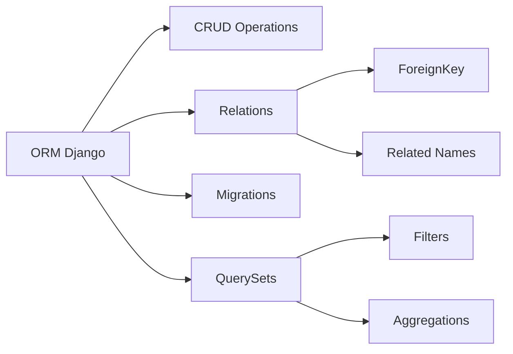

<div align="center">

# ✈️ Ynov Air - Application de Réservation de Vols


**Application web de démonstration pour la réservation de vols aériens**
Développée avec Django pour un cours sur les ORM et bases de données

[Installation](#-installation-et-déploiement-local) • [Fonctionnalités](#-fonctionnalités) • [Documentation](#-utilisation-pour-les-étudiants)

</div>

---

## 🚀 Fonctionnalités

<table>
<tr>
<td width="50%">

### 🔍 Recherche de vols
Recherche intuitive par aéroport de départ, d'arrivée et date

### 📝 Système de réservation
Réservation complète avec gestion des passagers et confirmation

### 💺 Gestion des sièges
Tracking automatique de la disponibilité des sièges en temps réel

</td>
<td width="50%">

### ⚙️ Interface d'administration
Panel d'administration complet via Django Admin

### 🎨 Design Ynov
Interface moderne aux couleurs de l'école (vert `#1f9e91`)

### 📊 Données de démonstration
Base pré-remplie avec 650+ vols et 10 aéroports

</td>
</tr>
</table>

## 📦 Modèles de données (ORM)

L'application utilise **4 modèles principaux** démontrant les concepts clés de l'ORM Django :

```python
┌─────────────┐         ┌─────────────┐
│   Airport   │◄────────┤    Flight   │
│             │         │             │
│  - code     │         │  - number   │
│  - name     │         │  - price    │
│  - city     │         │  - seats    │
└─────────────┘         └──────┬──────┘
                               │
                               │ ForeignKey
                               ▼
                        ┌─────────────┐         ┌──────────────┐
                        │   Booking   │────────►│  Passenger   │
                        │             │         │              │
                        │  - ref      │         │  - name      │
                        │  - status   │         │  - email     │
                        │  - price    │         │  - passport  │
                        └─────────────┘         └──────────────┘
```

### 🔗 Relations ORM démontrées

| Concept | Utilisation | Exemple |
|---------|-------------|---------|
| **ForeignKey** | Relations entre modèles | `Flight.origin → Airport` |
| **Validators** | Validation des données | `MinValueValidator`, `MaxValueValidator` |
| **Choices** | Statuts prédéfinis | `STATUS_CHOICES` pour vols/réservations |
| **auto_now_add** | Timestamps auto | `booking_date` dans Booking |
| **Related names** | Navigation inverse | `airport.departures.all()` |

## 🛠️ Installation et déploiement local

### 📋 Prérequis

-  Python 3.8 ou supérieur
-  pip (gestionnaire de paquets Python)

### 📥 Étapes d'installation

> **Note** : Ces commandes doivent être exécutées dans le terminal/invite de commandes

1. **Cloner ou télécharger le projet**

2. **Créer un environnement virtuel** (optionnel mais recommandé)
   ```bash
   python -m venv ynov_air
   ```

3. **Activer l'environnement virtuel**
   - Windows :
     ```bash
     ynov_air\Scripts\activate
     ```
   - Linux/Mac :
     ```bash
     source ynov_air/bin/activate
     ```

4. **Installer Django**
   ```bash
   pip install django
   ```

5. **Se placer dans le dossier ynovair**
   ```bash
   cd ynovair
   ```

6. **Créer les migrations** (si nécessaire)
   ```bash
   python manage.py makemigrations
   ```

7. **Appliquer les migrations**
   ```bash
   python manage.py migrate
   ```

8. **Peupler la base de données avec des données de démonstration**
   ```bash
   python manage.py populate_data
   ```

9. **Créer un superutilisateur** (pour accéder à l'admin)
   ```bash
   python manage.py createsuperuser
   ```
   Suivez les instructions (username, email, password)

10. **Lancer le serveur de développement**
    ```bash
    python manage.py runserver
    ```

11. **Accéder à l'application**

    | Interface | URL | Description |
    |-----------|-----|-------------|
    | 🌐 **Site public** | http://127.0.0.1:8000/ | Recherche et réservation de vols |
    | ⚙️ **Admin Panel** | http://127.0.0.1:8000/admin/ | Gestion des données |

---

## 🎓 Utilisation pour les étudiants

### Exercices ORM suggérés

Dans le shell Django (`python manage.py shell`), essayez :

```python
from flights.models import Airport, Flight, Passenger, Booking
from django.utils import timezone

# Lire tous les aéroports
airports = Airport.objects.all()

# Filtrer les vols par origine
flights_from_paris = Flight.objects.filter(origin__city="Paris")

# Compter les vols disponibles
available_flights = Flight.objects.filter(status='SCHEDULED', available_seats__gt=0).count()

# Recherche avec JOIN (ForeignKey)
cdg = Airport.objects.get(code="CDG")
cdg_departures = cdg.departures.all()

# Agrégation
from django.db.models import Avg, Sum, Count
avg_price = Flight.objects.aggregate(Avg('price'))

# Q objects pour des requêtes complexes
from django.db.models import Q
flights = Flight.objects.filter(
    Q(origin__city="Paris") | Q(destination__city="Paris")
)

# Créer une réservation
passenger = Passenger.objects.create(
    first_name="Jean",
    last_name="Dupont",
    email="jean.dupont@example.com",
    phone="0612345678",
    passport_number="12AB34567",
    date_of_birth="1990-01-01"
)

flight = Flight.objects.first()
booking = Booking.objects.create(
    booking_reference="TEST1234",
    flight=flight,
    passenger=passenger,
    number_of_passengers=1,
    total_price=flight.price,
    status='CONFIRMED'
)
```

### 💡 Concepts ORM à explorer

<details>
<summary><b>📚 Liste des 10 concepts essentiels</b> (cliquer pour développer)</summary>

| # | Concept | Description | Difficulté |
|---|---------|-------------|------------|
| 1 | **CRUD Operations** | Create, Read, Update, Delete | 🟢 Débutant |
| 2 | **QuerySets** | `filter()`, `exclude()`, `get()`, `all()` | 🟢 Débutant |
| 3 | **Relations** | ForeignKey, related_name | 🟡 Intermédiaire |
| 4 | **Aggregations** | Count, Sum, Avg, Max, Min | 🟡 Intermédiaire |
| 5 | **Annotations** | Ajouter des champs calculés | 🟡 Intermédiaire |
| 6 | **F expressions** | Opérations au niveau BDD | 🟠 Avancé |
| 7 | **Q objects** | Requêtes complexes (OR, AND, NOT) | 🟠 Avancé |
| 8 | **Transactions** | `atomic()`, `commit()`, `rollback()` | 🟠 Avancé |
| 9 | **Signals** | `pre_save`, `post_save`, `pre_delete` | 🔴 Expert |
| 10 | **Custom Managers** | Méthodes personnalisées | 🔴 Expert |

</details>

## 📁 Structure du projet

```
ynovair/
├── 📂 flights/                      # 🎯 Application principale
│   ├── 📄 models.py                 # Modèles ORM (Airport, Flight, Passenger, Booking)
│   ├── 📄 views.py                  # Vues (home, search, booking, etc.)
│   ├── 📄 urls.py                   # Routes URL
│   ├── 📄 admin.py                  # Configuration admin
│   ├── 📂 management/commands/
│   │   └── 📄 populate_data.py      # Commande pour peupler la BDD
│   └── 📂 migrations/               # Migrations de base de données
│
├── 📂 ynov_air/                     # ⚙️ Configuration du projet
│   ├── 📄 settings.py               # Paramètres Django
│   ├── 📄 urls.py                   # URLs principales
│   └── 📄 wsgi.py                   # Point d'entrée WSGI
│
├── 📂 templates/flights/            # 🎨 Templates HTML
│   ├── 📄 base.html                 # Template de base
│   ├── 📄 home.html                 # Page d'accueil
│   ├── 📄 search.html               # Recherche de vols
│   ├── 📄 flight_detail.html        # Détails d'un vol
│   ├── 📄 booking_create.html       # Formulaire de réservation
│   ├── 📄 booking_detail.html       # Confirmation
│   └── 📄 my_bookings.html          # Liste des réservations
│
├── 📂 static/css/                   # 💅 Fichiers statiques
│   └── 📄 style.css                 # Styles CSS (couleurs Ynov)
│
├── 📄 manage.py                     # 🔧 Utilitaire Django
├── 📄 db.sqlite3                    # 💾 Base de données SQLite
├── 📄 .gitignore                    # 🚫 Fichiers à ignorer
└── 📄 README.md                     # 📖 Ce fichier
```

---

## 🔧 Technologies utilisées

<div align="center">

| Technologie | Utilisation | Version |
|-------------|-------------|---------|
|  | Framework web Python | 5.2 |
|  | Base de données | 3 |
|  | Langage backend | 3.8+ |
|  | Structure pages | 5 |
|  | Style interface | 3 |

</div>

---

## 🎯 Points d'apprentissage clés



<details>
<summary><b>📖 Détails des concepts</b></summary>

| Concept | Description | Exemple dans le projet |
|---------|-------------|----------------------|
| **ORM vs SQL** | Abstraction de la base de données | `Flight.objects.all()` vs `SELECT * FROM flights` |
| **Migrations** | Gestion du schéma BDD | Fichiers dans `migrations/` |
| **Relations** | One-to-Many, Many-to-Many | `Flight → Airport` (ForeignKey) |
| **Validation** | Validators Django | `MinValueValidator(0)` |
| **Optimisation** | `select_related()`, `prefetch_related()` | Réduction des requêtes SQL |
| **Transactions** | Cohérence des données | `@transaction.atomic` dans `save()` |
| **Signals** | Logique automatisée | Events sur save/delete |

</details>

---

## ⚠️ Notes importantes

> **🎓 Usage pédagogique uniquement**

- ⚠️ La `SECRET_KEY` est visible (à changer en production)
- ⚠️ `DEBUG = True` activé (à désactiver en production)
- ✅ SQLite suffisant pour développement local
- ✅ Données de démonstration incluses

---

## 📚 Documentation et support

<div align="center">

[](https://docs.djangoproject.com/fr/5.2/topics/db/)
[](https://docs.python.org/3/)

</div>

### 🆘 Besoin d'aide ?

- 📖 [Documentation officielle Django ORM](https://docs.djangoproject.com/fr/5.2/topics/db/)
- 💬 [Django Community](https://www.djangoproject.com/community/)
- 🎥 [Tutoriels Django (français)](https://docs.djangoproject.com/fr/5.2/intro/tutorial01/)

---

## 👨‍🎓 Auteur

**Application développée pour Ynov**
Cours sur les bases de données et ORM - 3ème année

---

<div align="center">

Made with ❤️ for Ynov students


</div>
